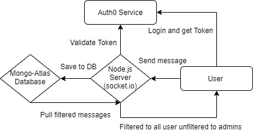
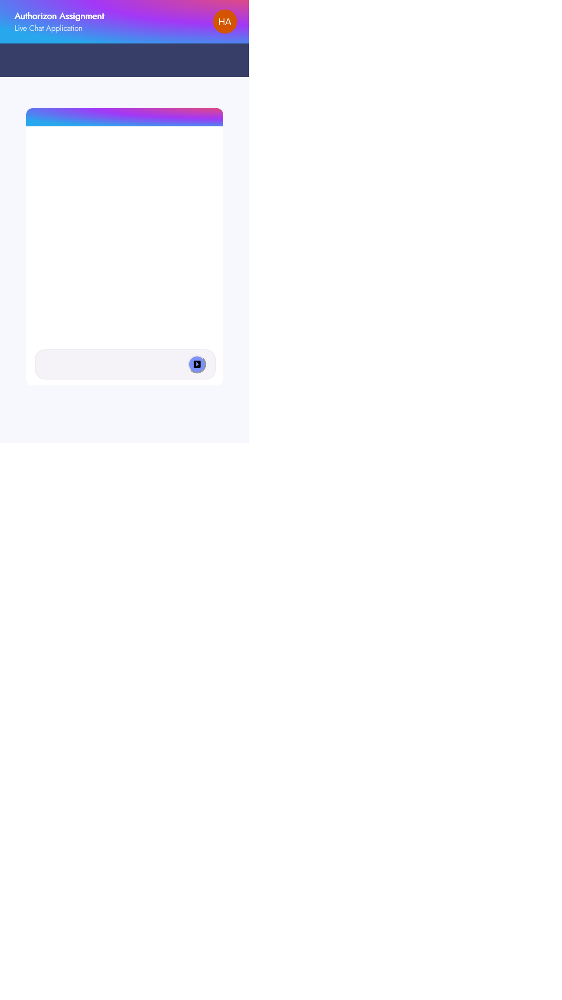

## Table of contents

- [Overview](#overview)
  - [The challenge](#the-challenge)
  - [Screenshot](#screenshot)
  - [Links](#links)
- [My process](#my-process)
  - [Built with](#built-with)
  - [What I learned](#what-i-learned)
  - [Continued development](#continued-development)
  - [Useful resources](#useful-resources)
- [Author](#author)
- [Acknowledgments](#acknowledgments)

## Overview

The Architecture of the app is pretty simple and looks like this:

In order to run locally:
git clone https://github.com/NitsanCohen770/authorizon-task

npm install && npm start

### The challenge

Users should be able to:

- Login with email and password using the Auth0 service.
- See all messages of other users in realtime.
- Admin users should be able to filter messages by choosing a filter.
- If a message if filtered, it is only visible to the Admin user.
- If a user uses a filtered word, he will get a message from the system informing him that the word is not allowed.
- An Admin user can invite other users to be Admins as well.

### Screenshot

-

### Links

- Live Site URL: [See Live](https://authorizon.netlify.app/)

## My process

The app was built with create-react-app and a node.js server running a socket.io instance.
I used MongoDB (with mongoose) as the database.

You can have a look at the architecture of the app in the above image.

The front-end was built with a mobile-only view using styled-components (almost no css libraries, only used Metrial-UI for the Avatar component).

The login process is handled by the Auth0 service using they're provided hook.

It is also worth mentioning that the /chat route is a protected route which means that if a user tries to enter this route he will be automatically redirected to the login interface.

Most of the chat logic is in the "useChat" hook in the hooks directory.

Upon every user connection to the backend a middleware is activated to check if the user is an admin user or not and then store the users' email along with his socket session id in the database.

The "Admins" and "Users" are then divided to 2 socket.io rooms - Admins room and Users room (will be used of course when emitting the filtered and unfiltered messages).

I chose to filter the messages with a database query.
I think it makes more sense to filter the messages if you are querying the database anyway to get the messages.

A user will receive a private message, informing him that he used a forbidden word, if he uses a word that is on the filter list.

You can add a new filter as an admin if you fill the input box (visible only for admins) and click Add filter button.

You can invite a user to be an admin if you fill his details (email) in the input box and press the Add admin button. The user invited will be notified that he has been invited and will be asked to press on his avatar and refresh the page if he agrees.

I did not use a React form for that because it seemed redundant.

issues:
First issue is with the validation of the token (server side) I did find a wonderful library (socketio-jwt) that is supposed to do the job and validate the token server but it didn't work for me. I didn't want to postpone the delivery of the assignment so for now I left like that (without validation). I did leave some of the code commented out so you can check it out.

There is another issue with storing the latest socket session id. I think it has to do with the cleanup function I am returning from the useEffect hook.
This issue does not have a lot of impact on the functionality of the app. The only problem is that sometimes the user will not see the invitation sent from the admin (because it is sent via session id).

### Built with

- CSS custom properties
- Flexbox
- Mobile-first workflow
- [React](https://reactjs.org/) - JS library
- [Styled Components](https://styled-components.com/) - For styles

### What I learned

It was very nice to get familiar with the Auth0 service. Integrating it to the app was a breeze thanks to the great official docs they have.

Besides that It was really fun getting involved with the auth

### Continued development

I would like to upgrade the app the serverless using AWS services and Next.js

### Useful resources

- [Auth0 offical docs](https://auth0.com/docs/) - This helped me for integrating the Auth0 in the React app. I really liked the straight forward tutorials with explained examples.

## Author

- LinkedIn - [@Nitsan Cohen](https://www.linkedin.com/in/nitsan-cohen-64b73920b/)

## Acknowledgments

My wife is first for letting me sit on the computer and taking care of the children meanwhile :D

I would also like to thank Authorizon staff for giving me this interesting assignment. I learned a lot from it and it improved my skills as a developer.
